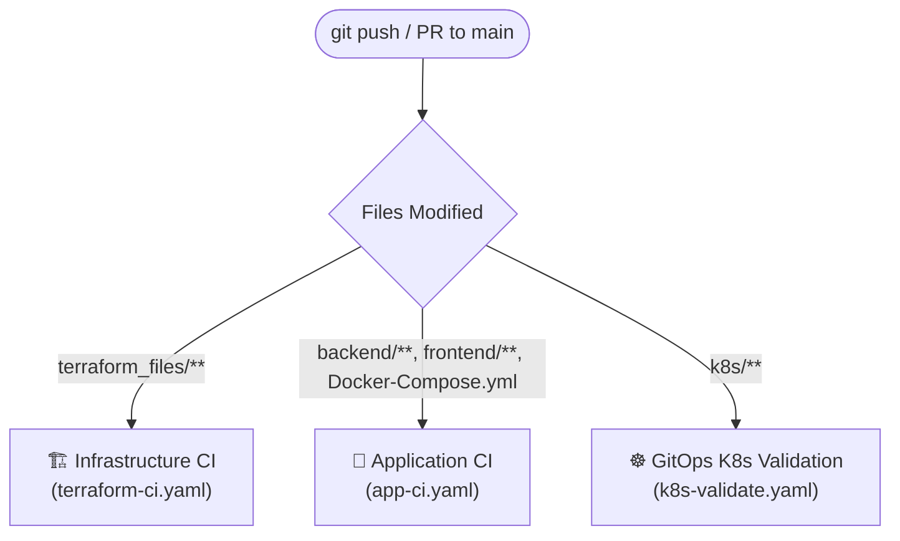

# GitHub Actions CI/CD Workflows

This directory contains the automated Continuous Integration (CI) and validation pipelines for the 3-Tier GitOps architecture.

Whenever code is pushed or a Pull Request is opened against the `main` branch, GitHub Actions automatically executes these checks to validate infrastructure, containers, and Kubernetes manifests before changes reach the cluster.

---

## ⚡ Smart Path Filtering

To minimize build times and resource consumption, each workflow utilizes **path filtering** (`paths:`). A workflow only runs if files within its specific domain are modified:



---

## 📋 Workflows Breakdown

### 1. `terraform-ci.yaml` — Infrastructure CI (Terraform)
* **Trigger**: Changes within `terraform_files/**`
* **Runner**: `ubuntu-latest`
* **Terraform Version**: `1.8.0`

#### Steps Executed:
1. **Checkout Code (`actions/checkout@v4`)**: Clones the repo onto the GitHub Actions runner.
2. **Setup Terraform (`hashicorp/setup-terraform@v3`)**: Installs the specified Terraform CLI version.
3. **Check Formatting (`terraform fmt -check`)**: Ensures all `.tf` files adhere to standard canonical formatting.
4. **Terraform Init (`terraform init -backend=false`)**: Downloads necessary modules (e.g., AWS VPC module) and provider plugins without requiring AWS cloud backend authentication or state locking.
5. **Terraform Validate (`terraform validate`)**: Verifies configuration syntax, resource attributes, and internal consistency.

---

### 2. `app-ci.yaml` — Application CI (Docker & Services)
* **Trigger**: Changes within `backend/**`, `frontend/**`, or `Docker-Compose.yml`
* **Runner**: `ubuntu-latest`
* **Node Version**: `18`

#### Steps Executed:
1. **Node.js Environment Setup (`actions/setup-node@v4`)**: Prepares the Node.js runtime.
2. **Validate Backend Dependencies**: Runs `npm ci` inside `backend/` to verify package dependencies.
3. **Validate Frontend Dependencies**: Runs `npm ci` inside `frontend/` to verify React dependencies.
4. **Docker Buildx (`docker/setup-buildx-action@v3`)**: Initializes the Buildx engine for container creation.
5. **Build Backend Container**: Test-builds `nikhil8871/3-tier-backend:${{ github.sha }}` from `backend/Dockerfile`.
6. **Build Frontend Container**: Test-builds `nikhil8871/3-tier-frontend:${{ github.sha }}` from `frontend/Dockerfile`.
> *Note: `push: false` ensures images are built only for test verification, avoiding unnecessary image registry clutter until pull requests are merged.*

---

### 3. `k8s-validate.yaml` — GitOps Kubernetes Validation
* **Trigger**: Changes within `k8s/**`
* **Runner**: `ubuntu-latest`

#### Steps Executed:
1. **Checkout Code**: Clones the Kubernetes manifests.
2. **Validate YAML Syntax**: Executes a Python script (`yaml.safe_load_all`) that recursively parses all manifests under `k8s/**/*.yaml`.
3. **ArgoCD Safety**: Catches YAML indentation errors, invalid syntax, or formatting mistakes before ArgoCD syncs them to the live cluster.

---

## 🔍 Quick Reference Summary

| Workflow File | Target Component | Trigger Paths | Key Commands / Validations |
| :--- | :--- | :--- | :--- |
| **`terraform-ci.yaml`** | AWS Infrastructure | `terraform_files/**` | `terraform fmt`, `terraform init`, `terraform validate` |
| **`app-ci.yaml`** | React & Node.js Apps | `backend/**`, `frontend/**`, `Docker-Compose.yml` | `npm ci`, Docker Build (`backend` & `frontend`) |
| **`k8s-validate.yaml`** | Kubernetes Manifests | `k8s/**` | Recursive Python YAML parsing (`yaml.safe_load_all`) |

---

## 🛠️ Testing Locally Before Pushing

Before pushing changes to GitHub, you can run the equivalent checks locally:

```bash
# 1. Format and validate Terraform:
cd terraform_files
terraform fmt
terraform validate

# 2. Test Node dependencies:
cd ../backend && npm test
cd ../frontend && npm test

# 3. Test Docker builds locally:
docker build -t test-backend ./backend
docker build -t test-frontend ./frontend
```
