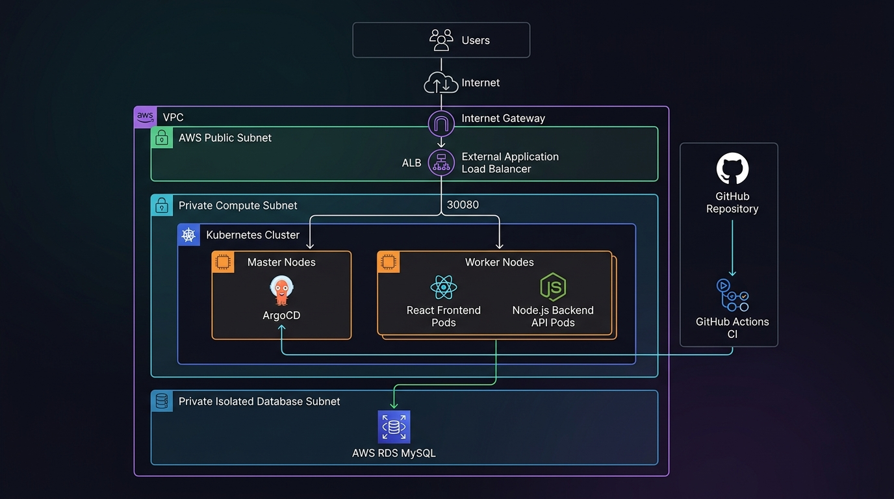

# Cloud-Native 3-Tier GitOps Architecture

Enterprise-ready 3-Tier cloud application (React, Node.js, AWS RDS MySQL) deployed on Kubernetes using GitOps continuous delivery via ArgoCD, Infrastructure as Code (IaC) via Terraform, and automated Continuous Integration (CI) via GitHub Actions.


---

## 🏗️ Architecture Overview

The system is architected across three distinct tiers with strict network isolation and declarative GitOps automation:

<p align="center">
  
</p>

```text
===================================================================================================
                                      1. DEVELOPER WORKFLOW
===================================================================================================
                                                │
                                        git push│
                                                ▼
===================================================================================================
                                     2. GITHUB REPOSITORY
===================================================================================================
        │                                       │                                       │
 changes to:                             changes to:                             changes to:
 terraform_files/**                      backend/** & frontend/**                k8s/**
        │                                       │                                       │
        ▼                                       ▼                                       ▼
┌─────────────────────────┐             ┌─────────────────────────┐             ┌─────────────────────────┐
│      TERRAFORM CI       │             │     APPLICATION CI      │             │       K8S LINT CI       │
│                         │             │                         │             │                         │
│ • terraform fmt         │             │ • npm test & build      │             │ • Validate YAML syntax  │
│ • terraform init        │             │ • Docker build & push   │             │ • Validate manifests    │
│ • terraform validate    │             │ • Tag SHA, v1, latest   │             │ • Check API versions    │
└─────────────────────────┘             └─────────────────────────┘             └─────────────────────────┘
        │                                       │
deploys │                                pushes │
infra   │                                image  │
        │                                       ▼
        │                               ┌─────────────────────────┐
        │                               │  DOCKER HUB REGISTRY    │
        │                               │                         │
        │                               │ • 3-tier-frontend:v1    │
        │                               │ • 3-tier-backend:v1     │
        │                               └─────────────────────────┘
        │                                            │
        │                                            │ pulls new
        │                                            │ images
        │                                            ▼
        │                               ┌─────────────────────────┐
        │       Monitors Git repo       │         ARGOCD          │
        │  ┌─────────────────────────── │  (CONTINUOUS DELIVERY)  │
        │  │                            └─────────────────────────┘
        │  │                                         │
        │  │ k8s/ manifests                          │ auto-syncs desired state
        │  │ (Single Source of Truth)                ▼
        │  │                            ┌─────────────────────────────────────────────────────────┐
        │  │                            │              AMAZON ROUTE 53 (GLOBAL DNS)               │
        │  │                            │               (Alias routing to ALB)                    │
        │  │                            └────────────────────────────┬────────────────────────────┘
        │  │                                                         │ User Traffic (:80/:443)
        ▼  ▼                                                         ▼
┌─────────────────────────────────────────────────────────────────────────────────────────────────┐
│                                   AWS CLOUD VPC (10.0.0.0/16)                                   │
│                                                                                                 │
│ ┌─────────────────────────────────────────────────────────────────────────────────────────────┐ │
│ │ 1. PUBLIC SUBNET (10.0.1.0/24)                                                              │ │
│ │    Internet Gateway (IGW) ──► External Application Load Balancer (ALB) + NAT Gateway        │ │
│ └──────────────────────────────────────────────┬──────────────────────────────────────────────┘ │
│                                                │ forwards traffic to NodePort :30080            │
│                                                ▼                                                │
│ ┌─────────────────────────────────────────────────────────────────────────────────────────────┐ │
│ │ 2. PRIVATE COMPUTE SUBNET (10.0.3.0/24) - KUBERNETES RUNTIME                                │ │
│ │                                                                                             │ │
│ │   [ Master Node ] ──► ArgoCD GitOps Controller (watches GitHub repo & reconciles state)     │ │
│ │                                                                                             │ │
│ │   [ Worker Nodes ]                                                                          │ │
│ │      ├── Frontend Service (NodePort :30080)                                                 │ │
│ │      │     └── React Frontend Pods (Nginx Reverse Proxy)                                    │ │
│ │      │           │                                                                          │ │
│ │      │           ▼ proxy_pass /api/*                                                        │ │
│ │      └── Backend Service (ClusterIP :4000)                                                  │ │
│ │            └── Node.js Express REST API Pods                                                │ │
│ └──────────────────────────────────────────────┬──────────────────────────────────────────────┘ │
│                                                │ connects securely over port 3306               │
│                                                ▼                                                │
│ ┌─────────────────────────────────────────────────────────────────────────────────────────────┐ │
│ │ 3. PRIVATE ISOLATED DATABASE SUBNET (10.0.5.0/24 & 10.0.6.0/24)                             │ │
│ │    AWS RDS MySQL 8.0 Multi-AZ Instance (dev-mysql-db)                                       │ │
│ └─────────────────────────────────────────────────────────────────────────────────────────────┘ │
└─────────────────────────────────────────────────────────────────────────────────────────────────┘
```

---

## ☸️ GitOps with ArgoCD: Deep Dive into `application.yaml`

The file [`argocd/application.yaml`](argocd/application.yaml) represents the GitOps engine of this project. Below is an exhaustive breakdown of every field, its operational meaning, and why it is configured this way:

```yaml
apiVersion: argoproj.io/v1alpha1
kind: Application
metadata:
  name: three-tier-app-v1
  namespace: argocd
  finalizers:
    - resources-finalizer.argocd.argoproj.io
spec:
  project: default
  source:
    repoURL: "https://github.com/nikhil8871/cloudnative-3tier-gitops.git"
    targetRevision: HEAD
    path: k8s
    directory:
      recurse: true
  destination:
    server: "https://kubernetes.default.svc"
    namespace: default
  syncPolicy:
    automated:
      prune: true
      selfHeal: true
    syncOptions:
      - CreateNamespace=true
```

> 📖 **Deep Dive Documentation:** For complete operations, UI access, and cluster setup instructions, see the dedicated [ArgoCD Documentation (`argocd/README.md`)](argocd/README.md).

### ❓ Why 2 Different Namespaces (`argocd` vs `default`)?
Even on a single-node or Master-only cluster, separating namespaces enforces production-grade isolation:
* **`metadata.namespace: argocd` (Control Plane):** Where the ArgoCD controller, repo server, and CRDs reside.
* **`spec.destination.namespace: default` (Workload Plane):** Where user-facing React pods, Node.js pods, and services are deployed.
* **Why Separate:** Prevents application crashes (OOM) or container security exploits in user pods from compromising or crashing the GitOps deployment engine and administrative secrets.

### Detailed Field Breakdown

| Line / Field | Technical Meaning (What it does) | Architectural Rationale (Why we use it) |
| :--- | :--- | :--- |
| **`apiVersion: argoproj.io/v1alpha1`** | Identifies the schema version of the ArgoCD Custom Resource Definition (CRD). | **Production Standard:** Although named `alpha1`, this is the permanent, standard CRD version used across all ArgoCD v1.x and v2.x releases for backward compatibility. |
| **`kind: Application`** | Specifies the Kubernetes resource type. | Tells the ArgoCD controller to track and sync a continuous deployment unit between Git and Kubernetes. |
| **`metadata.name: three-tier-app-v1`** | The unique identifier of this deployment unit. | Displayed as the top-level card in the ArgoCD Web UI and referenced in CLI operations (`argocd app get three-tier-app-v1`). |
| **`metadata.namespace: argocd`** | Specifies the namespace where the Application custom resource resides. | The ArgoCD controller process runs inside the `argocd` namespace and watches this namespace for application definitions. |
| **`finalizers: - resources-finalizer.argocd.argoproj.io`** | Enables **Cascade Deletion**. | **Prevents Zombie Resources:** If this Application is ever deleted, ArgoCD automatically cleans up all associated Deployments, Services, and ConfigMaps from the cluster. *(Note: Does not affect Terraform-managed AWS cloud infrastructure).* |
| **`spec.project: default`** | Assigns the app to an ArgoCD `AppProject` logical security boundary. | **Mandatory Field:** ArgoCD requires every app to belong to a project. The built-in `default` project allows deployments from any repository to any cluster without requiring custom RBAC policies. |
| **`source.repoURL`** | The Git repository location. | Serves as the **Single Source of Truth** for all cluster configurations. |
| **`source.targetRevision: HEAD`** | Specifies the Git ref (branch, tag, or commit) to track. | `HEAD` tracks the latest commit on the repository's default branch (`main`), deploying new changes immediately upon push. |
| **`source.path: k8s`** | The root folder inside the repository containing manifests. | Isolates application deployment manifests from application source code (`backend/`, `frontend/`) and Terraform files (`terraform_files/`). |
| **`source.directory.recurse: true`** | Enables recursive scanning of subdirectories. | Manifests are organized into domain folders (`k8s/backend/`, `k8s/frontend/`, `k8s/database/`). Without recursion, ArgoCD would only read manifests in the root of `k8s/`. |
| **`destination.server: "https://kubernetes.default.svc"`** | The API server endpoint of the target Kubernetes cluster. | **In-Cluster DNS:** Refers to the local Kubernetes cluster where ArgoCD is running. |
| **`destination.namespace: default`** | Target namespace for application workloads. | Deploys the Frontend, Backend, and Database objects into the `default` namespace. |
| **`syncPolicy.automated`** | Enables continuous reconciliation without manual button clicks. | Pure GitOps automation: changes pushed to `main` are automatically detected and deployed within minutes. |
| **`syncPolicy.automated.prune: true`** | Automatically deletes Kubernetes objects if their YAML file is removed from Git. | Guarantees exact 1:1 synchronization with Git. Deleting a resource file in Git immediately deletes it from the live cluster. |
| **`syncPolicy.automated.selfHeal: true`** | Automatically overwrites manual cluster edits. | **Prevents Configuration Drift:** If an engineer manually modifies or deletes a pod or service via `kubectl`, ArgoCD immediately overrides the drift and restores the Git-defined state. |
| **`syncOptions: - CreateNamespace=true`** | Pre-creates the destination namespace if it does not already exist. | Prevents deployment failures caused by missing Kubernetes namespaces. |

---

### Comparison: `Application` vs. `ApplicationSet`

| Feature | `Application` (Current Setup) | `ApplicationSet` (Multi-Cluster / EKS) |
| :--- | :--- | :--- |
| **Cardinality** | 1 Manifest = 1 Target Deployment | 1 Manifest = Generator for Multiple Applications |
| **Target** | Single Cluster / Single Namespace (`Stage`) | Multi-Environment (`dev`, `staging`, `prod`) or Multi-Cluster (EKS) |
| **Generators** | None (Static definition) | List, Git Directory, Cluster, Pull Request generators |
| **Best Used For** | Staging / Single-Cluster workloads | Scaling to Production across AWS EKS clusters |

---

## ⚡ CI/CD Pipelines (GitHub Actions)

This repository implements **smart path filtering** to optimize runner minutes and build times:

| Pipeline | Trigger Path | Operations Executed |
| :--- | :--- | :--- |
| **`terraform-ci.yaml`** | `terraform_files/**` | • `terraform fmt -check`<br>• `terraform init -backend=false`<br>• `terraform validate` |
| **`app-ci.yaml`** | `backend/**`, `frontend/**`, `Docker-Compose.yml` | • Node.js 18 dependency validation (`npm ci`)<br>• Docker Buildx compilation<br>• Authenticated login to Docker Hub<br>• Builds & pushes `nikhil8871/3-tier-backend` & `nikhil8871/3-tier-frontend` (tagged `:SHA`, `:v1`, `:latest`) |
| **`k8s-validate.yaml`** | `k8s/**` | • Recursive Python YAML parser (`yaml.safe_load_all`)<br>• Syntax and indentation safety verification prior to ArgoCD sync |

---

## 📁 Repository Structure

```text
.
├── .github/
│   └── workflows/
│       ├── app-ci.yaml             # Docker build, test & push pipeline
│       ├── k8s-validate.yaml       # Kubernetes YAML syntax validator
│       ├── terraform-ci.yaml       # Terraform linting & validation
│       └── README.md               # Detailed CI/CD workflow docs
├── argocd/                         # ArgoCD GitOps Continuous Delivery
│   ├── application.yaml            # ArgoCD Application manifest (watches k8s/)
│   └── README.md                   # Dedicated ArgoCD documentation
├── backend/                        # Node.js Express REST API
│   ├── DbConfig.js                 # MySQL database connection pool
│   ├── TransactionService.js       # Transaction business logic
│   ├── Dockerfile                  # Production container definition
│   └── package.json
├── frontend/                       # React 18 Single-Page Application
│   ├── src/                        # Styled React UI components
│   ├── nginx.conf                  # Nginx reverse proxy configuration
│   ├── Dockerfile                  # Multi-stage production container
│   └── package.json
├── k8s/                            # Declarative Kubernetes Workload Manifests
│   ├── backend/
│   │   ├── deployment.yaml         # Backend pods (Wave 2 + wait-for-db Init Container)
│   │   └── service.yaml            # Internal ClusterIP (port 4000, Wave 2)
│   ├── database/
│   │   ├── configmap.yaml          # DB_HOST, DB_NAME, DB_USER (Wave 1)
│   │   └── secret.yaml             # Base64-encoded DB credentials (Wave 1)
│   └── frontend/
│       ├── deployment.yaml         # Frontend pods (Wave 3)
│       └── service.yaml            # External LoadBalancer (NodePort 30080, Wave 3)
├── terraform_files/                # AWS Infrastructure as Code
│   ├── vpc.tf                      # Custom VPC, Subnets, Gateways, Route Tables
│   ├── rds.tf                      # AWS RDS MySQL 8.0 database in private subnets
│   ├── alb.tf                      # AWS External Application Load Balancer & Target Group (NodePort 30080)
│   ├── sg.tf                       # Security Groups (external_alb_sg, worker_node_sg, db-sg)
│   ├── key-pair.tf                 # SSH access keys
│   ├── provider.tf                 # AWS provider configuration
│   ├── var.tf                      # Configurable input variables
│   └── output.tf                   # Live ALB URL, RDS endpoints & ConfigMap automation
├── docs/                           # Architectural diagrams and flowcharts
├── Docker-Compose.yml              # Local developer environment
└── README.md                       # Main project documentation
```

---

## 🔄 End-to-End Pipeline Execution Order & Flow

Understanding which component executes first and how data flows across the pipeline:

```text
1. TERRAFORM (Run Once by Engineer / Infra Team)
   You run: cd terraform_files && terraform apply
   Why: Infrastructure (VPC, RDS Database, External ALB) is long-lived and does not change on every code commit.
   Note: terraform_files/output.tf automatically writes the generated RDS endpoint directly into k8s/database/configmap.yaml!

             │ (Outputs RDS Endpoint & auto-populates configmap.yaml)
             ▼
2. GITHUB REPOSITORY (Save endpoint & secret)
   Terraform auto-populates k8s/database/configmap.yaml.
   Set your database password in k8s/database/secret.yaml.
   You git commit & push to GitHub.

             │ (git push event triggers CI)
             ▼
3. GITHUB ACTIONS (Automated CI via Event Triggers)
   Configured in: .github/workflows/app-ci.yaml
   Line 4: on: push: branches: [ main ]
   When you push code, GitHub Actions automatically wakes up, installs dependencies, builds the Docker images, and pushes them to Docker Hub.

             │ (ArgoCD polls GitHub / GitOps reconciliation)
             ▼
4. ARGOCD (Automated GitOps Runtime Delivery)
   Configured in: argocd/application.yaml
   Line 20: syncPolicy: automated: prune: true, selfHeal: true
   ArgoCD continuously watches your GitHub repo. When it sees the new commit, it automatically deploys the manifests to Kubernetes.
```

---

### 🔐 Kubernetes Secret Auto-Decoding Mechanism

When defining database passwords in [`k8s/database/secret.yaml`](k8s/database/secret.yaml):

```yaml
apiVersion: v1
kind: Secret
metadata:
  name: db-secret
type: Opaque
data:
  DB_PWD: MTIzNDU2Nzg5 # base64 for '123456789'
```

* **How it works:** Kubernetes securely stores the password in Base64 in `etcd`.
* **Automatic Decoding:** When the Secret is injected into the backend pod via `secretKeyRef`, **Kubernetes automatically base64-decodes it into plaintext**.
* **Application View:** Inside [`backend/DbConfig.js`](backend/DbConfig.js), `process.env.DB_PWD` directly receives the original plaintext string (`"123456789"`), requiring no decoding logic in application code.

---

## 🚀 Quick Deployment Guide

### 1. Provision Infrastructure with Terraform
```bash
cd terraform_files
terraform init
terraform plan
terraform apply -auto-approve
```
> 💡 *Note: Terraform automatically writes the new RDS database endpoint into `k8s/database/configmap.yaml` using the `local_file` resource in `output.tf`.*

### 2. Configure Kubernetes Secrets
Encode your database password and save it in `k8s/database/secret.yaml`:
```bash
echo -n "YourSecurePassword" | base64
```

Push any configuration updates to GitHub:
```bash
git add k8s/database/configmap.yaml k8s/database/secret.yaml
git commit -m "infra: update database configs"
git push origin main
```

### 3. Deploy Application via ArgoCD
Apply the GitOps application controller manifest to your cluster:
```bash
kubectl apply -f argocd/application.yaml
```

ArgoCD will automatically discover the manifests, pull the container images from Docker Hub, provision the Kubernetes pods, and reconcile state continuously.
